# Schemat dzialania systemu

## Uzytkownicy

- **Agencja** (np. `NASA`, `ESA`) — publikuje zlecenia, odbiera potwierdzenia oraz komunikaty administratora.
- **Przewoznik** (np. `C1`, `C2`) — obsluguje 2 z 3 typow uslug, odbiera zlecenia z wybranych kolejek roboczych, wysyla potwierdzenia, odbiera komunikaty administratora.
- **Administrator** — sledzi caly ruch w systemie i moze rozsylac komunikaty.

## Exchange

Jeden topic exchange: **`space.events`**.

## Kolejki i wiazania

| Kolejka            | Wiazania (klucze)                                   | Konsument                              |
|--------------------|------------------------------------------------------|----------------------------------------|
| `service.osoby`    | `order.osoby`                                        | wszyscy przewoznicy obslugujacy osoby  |
| `service.ladunek`  | `order.ladunek`                                      | wszyscy przewoznicy obslugujacy ladunek|
| `service.satelita` | `order.satelita`                                     | wszyscy przewoznicy obslugujacy satelite|
| `agency.<NAZWA>`   | `confirm.<NAZWA>`, `broadcast.agencies`, `broadcast.all` | dana agencja                       |
| `carrier.<ID>`     | `broadcast.carriers`, `broadcast.all`                | dany przewoznik (broadcasty)           |
| `admin.<auto>`     | `order.*`, `confirm.*`, `broadcast.*`                | administrator (kopia ruchu)            |

Kolejki `service.*` sa wspoldzielone — RabbitMQ dystrybuuje zlecenia round-robin pomiedzy podlaczonych przewoznikow z `prefetch_count=1` i recznym ack, dzieki czemu kazde zlecenie trafia do dokladnie jednego wolnego przewoznika.

Kolejki `agency.*` oraz `carrier.*` sa exclusive — jeden konsument na kolejke.

## Klucze routingu

| Kierunek                                  | Klucz                            |
|-------------------------------------------|----------------------------------|
| Agencja -> system (zlecenie)              | `order.osoby` / `order.ladunek` / `order.satelita` |
| Przewoznik -> agencja (potwierdzenie)     | `confirm.<NAZWA_AGENCJI>`        |
| Administrator -> agencje                  | `broadcast.agencies`             |
| Administrator -> przewoznicy              | `broadcast.carriers`             |
| Administrator -> wszyscy                  | `broadcast.all`                  |

## Diagram

Zrodlo: [`schemat.d2`](schemat.d2). Render: `d2 --layout=elk schemat.d2 schemat.svg` (lub `schemat.png`).

